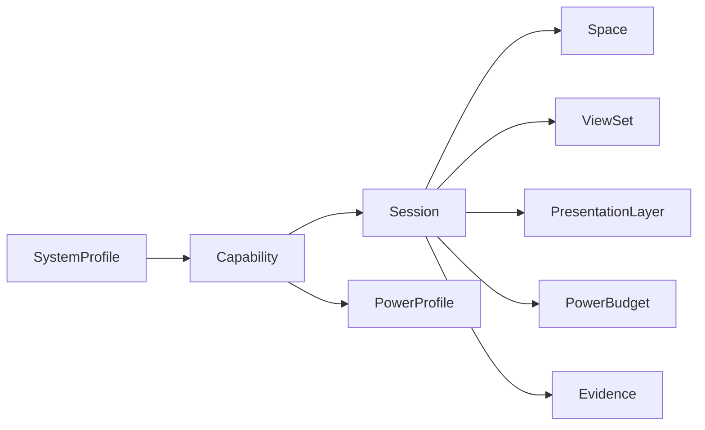
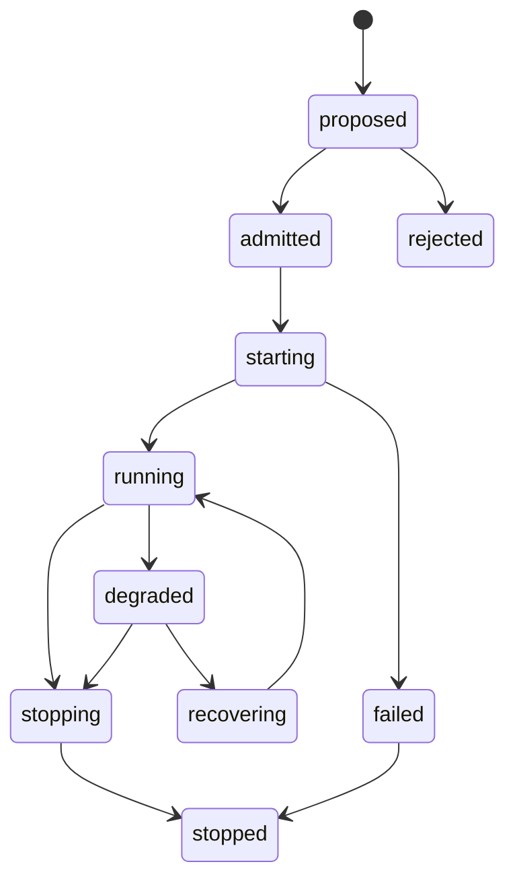

# Meiso Glass SDK Bible：设计总纲

> 状态：Bible v0.4 XR-core 草案
> 修订日期：2026-06-13
> 适用范围：SDK 抽象、XR/AR presentation contract、空间/显示/传感扩展槽、功耗 admission、endpoint/SDC/host 协作
> 不适用范围：完整 OpenXR runtime、游戏引擎、shader/material、板级飞线指南、BSP 移植手册、最终用户教程

## 0. 本版一句话结论

**Meiso Glass SDK 应该借鉴 OpenXR 的对象骨架，但不能照抄 OpenXR。**

OpenXR 解决的是“应用如何面对一个 XR runtime”。Meiso Glass SDK 解决的是“一个 AR 眼镜系统内部，endpoint、SDC、host、传感器、显示、链路、功耗和证据如何用同一套 contract 协作”。所以本 SDK 不应该成为完整 OpenXR runtime，也不应该成为渲染引擎；它应该成为一个 **XR-oriented device/session/power contract layer**。

本版把 SDK 核心压缩为 10 个一等对象：

```text
SystemProfile
Capability
ResourceTier
Session
Space
ViewSet
PresentationLayer
PowerBudget
PowerProfile
Evidence
```

能从这 10 个对象推出的内容，进入 SDK bible。不能从这 10 个对象推出的内容，暂时不进入 core。

## 1. 本轮 XR / AR / VR API 调研结论

本轮重点看了 OpenXR、OpenXR SDK Source、Monado、WebXR、Godot XR、StereoKit 这类开放标准或开源 SDK/Runtime。它们对 Meiso 的启发如下：

| 来源 | 值得借的部分 | 不应该照抄的部分 | Meiso 落地 |
|---|---|---|---|
| OpenXR | `instance/system/session/space/view/swapchain/action/layer` 的对象边界；runtime 负责 tracking、composition、peripheral；应用提交 frame/layer | 完整 loader、API layer、所有 graphics binding、controller/haptics 全量模型 | 借对象边界，不做 OpenXR 兼容层 |
| OpenXR SDK Source | loader、validation layer、trace layer、sample 分离；SDK source 和应用最小依赖分离 | 动态 loader 机制、平台 manifest 机制 | 用 contract test / trace，不做动态插件 loader |
| Monado | `system/device/compositor/space/tracking/prober/driver` 分层；driver 实现设备接口；复杂逻辑放辅助库 | 直接暴露 Monado XRT 内部接口；完整 HMD runtime | 借 prober/adapter/system builder 思路，保持 Meiso public contract 稳定 |
| WebXR | `XRSession`、`XRFrame`、`XRView`、`XRReferenceSpace`、feature descriptor；AR anchors/hit-test 是按 feature 进入 session | WebGL/browser 事件模型；浏览器权限模型 | 借 `session + frame + view + space + feature slot`，不绑定 WebGL |
| Godot XR | XR action map 用“语义 action”隔离设备原始输入；reference space 影响整个 XR 场景解释 | 游戏引擎节点系统和 controller 交互全套 | V0 只保留 semantic input/action slot，不做完整 action map |
| StereoKit | 面向应用的 API 非常短；OpenXR 之上提供 MR input、UI、asset、simulator；强调 mobile performance by default | UI/physics/asset pipeline/shader 系统 | 借“短 API + simulator + performance default”，不把 SDK 变成 app framework |

### 1.1 要保留的 XR 核心

Meiso SDK 保留这些核心：

1. **System**：一套可被用户使用的 endpoint/SDC/host 组合，不是一块芯片。
2. **Session**：所有持续行为的生命周期，例如 lowfi sensing、rich video、display AR、presentation、debug capture。
3. **Space**：head、display、camera、eye、world、SDC fusion 的坐标关系。
4. **View**：单眼、双眼、多 view、3D display 的最小显示视图抽象。
5. **Layer**：HUD、status、AR overlay、video、depth-aware、calibration 等呈现层。
6. **Frame timing**：什么时候呈现、是否错过 deadline、是否降帧/降刷新。
7. **Action / input slot**：触控、按键、wear state、voice wake、gaze hint 这类语义输入。
8. **Extension slot**：未来 depth、anchor、hit-test、mesh、scene semantics 只作为 capability/feature 扩展进入。
9. **Validation / trace**：开发期 contract 检查和证据回放。

### 1.2 要删掉或推迟的部分

这些东西容易把 bible 写散，当前不进入 core：

| 不进入 core | 原因 | 替代方式 |
|---|---|---|
| 完整 OpenXR loader/runtime | 目标错位；Meiso 是设备/系统 SDK，不是标准 runtime | 后续可做 OpenXR bridge，但 bridge 只消费 Meiso contract |
| Vulkan/OpenGL/Metal/D3D binding | 初版 endpoint 可能只是接收 SDC 内容，不一定本地渲染复杂 scene | `PresentationSurface` 只描述 surface/stream，不描述 graphics API |
| Shader/material/scene graph | 这是 render engine 或 app framework 责任 | SDK 只管 layer contract 和 frame timing |
| 完整 controller action map/haptics | 眼镜 V0 输入不是双手柄 VR | 保留 `SemanticAction` 槽，等触控/语音/手势稳定后扩展 |
| 全量 anchors/hit-test/mesh API | V0 没有稳定 spatial stack | 先定义 `SpatialCapability` 和 `SpatialQuery` declared slot |
| 每种未来相机一个 adapter | 会变成幻想 BOM 清单 | 先用 sensor role/modality/spatial semantics 表达未来能力 |
| API layer 插件系统 | 早期复杂度过高 | 用 contract test、trace recorder、mock wrapper |

## 2. SDK 的真正定位

```text
application / tool / test
        |
Meiso SDK public API
        |
core contract: capability + session + space + view + layer + power + evidence
        |
runtime admission + policy
        |
ports / adapters
        |
endpoint / SDC / host hardware and processes
```

Meiso SDK 的职责：

- 描述 endpoint、SDC、host 有什么能力。
- 接收一个 intent，生成可执行 session plan。
- 在启动 session 前做 power/link/thermal/admission 判断。
- 管理持续 session 的状态、降级、恢复、停止。
- 记录证据，证明为什么某个 session 被接受、拒绝或降级。
- 为单眼初版、未来双眼、多 view、3D display、depth/spatial 能力保留稳定扩展位。

Meiso SDK 不做：

- 不替代 OpenXR runtime。
- 不替代 Unity/Godot/StereoKit/Three.js。
- 不定义 shader/material/scene graph。
- 不把 i.MX8MM、Orin、HM0360、GW1NZ、LR2021 写成 core enum。
- 不把 `power_level_u8` 伪装成真实 mW。

## 3. 三个运行角色

| 角色 | SDK 职责 | 不能越界做什么 |
|---|---|---|
| `endpoint` | 眼镜侧传感器、显示、低功耗策略、无线链路、端侧 adapter、端侧 measurement | 把 BSP 设备路径暴露成 public API；绕过 session 直接开大资源 |
| `sdc` | 空间融合、AI、回放、rich media 接收、session orchestration、私有网络策略 | 直接假设 endpoint 的硬件路径；把应用渲染细节塞进 endpoint core |
| `host` | 开发、测试、配置、模拟、抓日志、回放、contract validation | 成为产品运行时依赖；持有本地敏感配置进入 remote 仓库 |

角色是 contract，不是进程名。测试时一个进程可以模拟多个角色，但日志和 capability 必须保留真实 role。

## 4. 核心对象图



| 对象 | 最小定义 | 典型问题 |
|---|---|---|
| `SystemProfile` | 一个可运行系统的装配声明 | 这个 endpoint/SDC 组合有哪些已知能力？哪些只是 declared？ |
| `Capability` | 可被请求的能力 | 能做什么？属于哪个 role？依赖什么资源？已验证到什么程度？ |
| `ResourceTier` | 大小系统资源层级 | 是 sentinel 小资源，还是 rich 大资源，还是升级路径？ |
| `Session` | 持续行为生命周期 | 谁请求了什么？runtime 实际选了什么？现在状态是什么？ |
| `Space` | 坐标系和空间关系 | camera/display/head/world/SDC 之间怎么变换？可信度多少？ |
| `ViewSet` | 一个 presentation session 的 view 集合 | 单眼、双眼、多 view、3D display 如何表达？ |
| `PresentationLayer` | 要呈现的内容层 | HUD、status、video、AR overlay、depth-aware 谁在上面？ |
| `PowerBudget` | 本 session 的能量/功率/热/链路预算 | 能不能启动？怎么降级？ |
| `PowerProfile` | adapter 的可用功耗点和证据 | 每个 level 的 mW/latency/confidence 从哪来？ |
| `Evidence` | 可回放证据 | 为什么这么调度？真实观测是什么？ |

## 5. spec / status / evidence 三分法

所有长生命周期对象都用同一种形状：

```yaml
metadata:
  id: string
  revision: string
  owner_role: endpoint | sdc | host
spec:
  desired_or_declared_shape: map
status:
  observed_or_selected_state: map
evidence:
  measurements: []
  logs: []
  validation: []
  unknowns: []
```

规则：

1. `spec` 是请求或声明，不代表已经发生。
2. `status` 是 runtime 选择或 adapter 观察到的状态。
3. `evidence` 是测量、日志、校验和来源。
4. 任何 admission、降级、失败都必须能在 `evidence` 中找到原因。

## 6. SystemProfile 与 Capability

`SystemProfile` 是平台装配文件，不是普通 config。它应该声明“系统可能有什么能力，以及这些能力的验证状态”。

```yaml
SystemProfile:
  profile_id: meiso.endpoint.mx8mm.devkit.v0
  role: endpoint
  platform_family: mx8mm_dev
  capabilities:
    - /cap/camera/world/lowfi
    - /cap/camera/world/rich
    - /cap/camera/eye/hint
    - /cap/display/primary/mono
    - /cap/radio/lr2021/telemetry_tx
    - /cap/radio/ble/command_rx
    - /cap/power/rail_probe
  default_policy: /policy/product/default
  measurement_sources:
    - declared_only
    - bench_fixture
  unknowns:
    - display_panel_power_curve_unmeasured
    - stereo_view_not_populated
```

`Capability` 是 SDK 判断能不能做某事的入口：

```yaml
Capability:
  metadata:
    capability_id: /cap/display/primary/mono
    family: display
    owner_role: endpoint
  spec:
    resource_tier:
      display: interactive
      link: high_bandwidth_rx
      compute: a53_gpu
    output_forms: [presentation_surface]
    required_spaces: [/space/head, /space/display/primary]
    power_profile_ref: /power/display/primary
  status:
    availability: available | unavailable | degraded | blocked
    validation_state: declared | mocked | detected | smoke_tested | measured | blocked
  evidence:
    measurement_source: declared_only | rail_probe | bench_fixture | product_calibrated
    confidence_level_u8: 32
    unknowns: []
```

Capability 命名使用语义路径，不使用裸设备节点：

```text
/cap/camera/world/lowfi
/cap/camera/world/rich
/cap/camera/eye/hint
/cap/display/primary/mono
/cap/presentation/mono_hud
/cap/spatial/depth/future
/cap/radio/lr2021/telemetry_tx
/cap/power/rail_probe
```

## 7. Session 是唯一持续行为入口

所有非瞬时操作都必须是 session：

- `lowfi_sensing`
- `eye_hint`
- `rich_video`
- `display_ar`
- `presentation`
- `audio_capture`
- `spatial_query`
- `debug_capture`
- `power_measurement`

状态机：



最小 session：

```yaml
Session:
  metadata:
    session_id: sess_...
    owner_role: sdc
    idempotency_key: req_...
  spec:
    session_type: presentation
    requested_capabilities: [/cap/presentation/mono_hud]
    priority: user_visible
    power_budget_ref: /budget/interactive_low
    required_spaces: [/space/head, /space/display/primary]
  status:
    state: admitted | running | degraded | stopped | failed
    selected_capabilities: []
    selected_power_levels: {}
    degradation_reason: null
  evidence:
    admission_trace: []
    frame_stats: []
    power_summary: null
```

## 8. Space：AR 眼镜必须有坐标 contract

AR SDK 不能只管媒体流。即便 V0 不做完整 SLAM，SDK 也要能表达坐标关系，否则 eye hint、display、world camera、future depth 都会散掉。

核心 space：

| Space | 含义 |
|---|---|
| `/space/head` | 用户头部/眼镜刚体参考系 |
| `/space/display/primary` | 初版单眼显示光学参考系 |
| `/space/camera/world_lowfi` | 低功耗世界相机参考系 |
| `/space/camera/world_rich` | rich color camera 参考系 |
| `/space/camera/eye_primary` | 眼动 hint camera 参考系 |
| `/space/sdc/world` | SDC 融合后的世界参考系 |
| `/space/local` | 当前 session 本地参考系 |

`SpaceRelation` 只要求最小姿态、时间和可信度：

```yaml
SpaceRelation:
  from: /space/camera/world_lowfi
  to: /space/head
  timebase: monotonic
  timestamp_ns: 0
  pose:
    position_m: [0, 0, 0]
    orientation_xyzw: [0, 0, 0, 1]
  validity: valid | estimated | unavailable
  confidence_level_u8: 0
  source: factory_calibration | runtime_tracking | declared_only
```

V0 可以只有 declared/factory calibration；但字段必须现在就定，否则未来 stereo/depth/SLAM 会返工。

## 9. ViewSet：单眼是 profile，不是 core 假设

初版单眼：

```yaml
ViewSet:
  viewset_id: /viewset/mono_primary
  topology: mono
  views:
    - view_id: primary
      eye: none
      display_space: /space/display/primary
      recommended_resolution: [640, 480]
      supported_refresh_hz: [30, 60]
      projection_kind: profile_declared
  depth_composition: unsupported
```

未来双眼/多 view/3D：

```yaml
ViewSet:
  topology: stereo | multiview | three_d
  views:
    - {view_id: left_primary, eye: left, display_space: /space/display/left}
    - {view_id: right_primary, eye: right, display_space: /space/display/right}
  stereo_mode: side_by_side | dual_surface | time_multiplexed | optical_engine_specific
  depth_composition: none | declared | supported | measured
```

规则：

1. `DisplayAdapter` 管 panel/link/brightness/refresh/power。
2. `ViewSet` 管有几个 view、每个 view 对应什么 space/projection/viewport。
3. `PresentationLayer` 管内容层和合成意图。
4. `RenderEngine` 不进入 SDK core。

## 10. PresentationContract：SDK 管呈现，不管渲染引擎

`PresentationLayer`：

```yaml
PresentationLayer:
  layer_id: hud_main
  layer_type: status | hud | ar_overlay | video | calibration | depth_mask | passthrough_hint | debug
  target_views: [primary]
  source:
    kind: sdc_stream | endpoint_generated | static_asset | diagnostic
    surface_ref: /surface/hud/main
  composition:
    order: 10
    alpha_mode: opaque | premultiplied | additive
    space: /space/display/primary | /space/head | /space/sdc/world
  constraints:
    max_latency_ms: 50
    min_refresh_hz: 30
    allow_drop: true
  power_hints:
    brightness_policy: auto | capped | fixed
    allow_refresh_degrade: true
    allow_viewport_scale: true
```

`FrameTiming`：

```yaml
FrameTiming:
  predicted_display_time_ns: int
  deadline_ns: int
  submitted_time_ns: int | null
  displayed_time_ns: int | null
  missed_deadline: bool
  drop_reason: none | late | power_policy | link_congestion | adapter_busy
```

Meiso SDK 不定义应用怎么画一个 HUD，但必须知道 HUD 的 layer type、target view、frame timing、功耗约束和降级路径。

## 11. SpatialCapability：深度/锚点/mesh 先作为扩展槽

未来 depth camera、stereo camera、IR、event camera、scene mesh、anchors、hit-test 都不能现在写成具体 adapter。正确做法是定义能力槽：

```yaml
SensorSlot:
  slot_id: /slot/camera/depth/front_future
  sensor_role: depth | world | eye | ir | event | calibration | debug
  capture_modality: depth_tof | structured_light | stereo_pair | rgb | ir | event | unknown
  mounted_space: /space/camera/depth_front
  validation_state: declared
```

```yaml
SpatialCapability:
  capability_id: /cap/spatial/depth/future
  spatial_role: depth | occlusion | hit_test | anchor | mesh | scene_semantics | pose
  source_slots: [/slot/camera/depth/front_future]
  output_forms: [depth_map, confidence_map, point_cloud, plane, mesh, anchor, hit_result]
  coordinate_space: /space/sdc/world | /space/head | /space/camera/depth_front
  validation_state: declared
```

规则：

- `declared` 能进 profile，不能被 runtime 当成可用能力。
- `detected` 只能说明设备存在，不能说明有稳定输出。
- `measured` 才能进入自动 power policy。
- 未来新增 depth adapter 时，必须消费同一 `SpatialCapability` contract。

## 12. 功耗定位：admission 的第一等约束

本版把功耗模型简化成 4 个必需概念：

| 概念 | 用途 | 是否 core 必需 |
|---|---|---|
| `PowerBudget` | session 请求侧的预算 | MUST |
| `PowerLevel` | adapter 内部策略等级，`0..255` | MUST |
| `PowerCostPoint` | 某 level 下的 mW/latency/thermal/confidence | MUST |
| `MeasuredPowerPoint` | 实测证据 | SHOULD，V0 可 `declared_only` |

`PowerLevel` 仍保留 8-bit，但只规定分段，不要求 256 档都支持：

| 范围 | 含义 |
|---|---|
| `0` | off |
| `1..31` | retention / wake ready |
| `32..63` | sentinel |
| `64..95` | sparse capture |
| `96..127` | local process |
| `128..159` | low stream |
| `160..191` | rich stream / interactive display |
| `192..223` | peak stream |
| `224..255` | debug / calibration / boost |

`PowerCostPoint`：

```yaml
PowerCostPoint:
  level: 64
  adapter_state: active
  settings: {}
  expected_mw: null
  peak_mw: null
  thermal_risk_u8: 32
  wake_latency_ms: 20
  settle_latency_ms: 5
  unit_cost:
    uj_per_event: null
    uj_per_frame: null
    bytes_per_joule: null
  measurement_source: declared_only | datasheet_estimate | driver_counter | rail_probe | bench_fixture | product_calibrated
  confidence_level_u8: 32
```

本版不再要求所有 adapter 都填完整 `state/duty/throughput/quality/latency/thermal` 七维字段。那些字段可以作为 family-specific `settings` 或 `cost_detail` 出现。这样文档更清楚，代码也更容易先落地。

## 13. ResourceTier：保留大小系统，但减少散度

```yaml
ResourceTier:
  compute: sentinel | low_power_helper | app_cpu | sdc_ai | debug
  vision: none | lowfi | eye_hint | rich | depth_future
  audio: none | wake | voice_hint | capture | array
  display: none | status | hud | interactive | video | calibration
  link: none | low_power_control | telemetry | high_bandwidth_rx | high_bandwidth_tx | debug
  payload: event | tuple | tile | compressed_stream | raw
```

ResourceTier 的职责只有两个：

1. admission 时判断是否允许唤醒大资源。
2. evidence 中解释一次 session 为什么耗电。

不要让 ResourceTier 变成硬件型号表。

## 14. V0 推荐最小 SDK surface

V0 应先实现这些 public API / command：

```text
query_system_profile()
query_capabilities(filter)
propose_session(spec)
start_session(session_id | spec, idempotency_key)
stop_session(session_id, reason)
get_session_status(session_id)
subscribe_telemetry(families)
get_evidence(session_id)
```

V0 最小 session types：

```text
lowfi_sensing
eye_hint
rich_video
presentation
audio_capture
power_measurement
debug_capture
```

V0 不做：

```text
OpenXR bridge
RenderAdapter
DepthCameraAdapter
full action map
anchors public API
hit-test public API
mesh public API
```

这些可以先作为 `declared` capability 和 schema test 存在。

## 15. 文档收敛规则

仍然只维护三份 bible：

| 文件 | 负责什么 |
|---|---|
| `SDK_DESIGN_OVERVIEW.md` | 边界、原则、核心对象、XR 抽象取舍 |
| `SDK_SUBSYSTEM_DESIGN.md` | 字段、状态机、adapter contract、plane、profile、测试 contract |
| `SDK_DEVELOPMENT_PLAN.md` | phase gate、验收、风险、未决问题、代码化顺序 |

不新增独立 guide、ADR、protocol、platform、checklist，除非某个内容已经稳定、被重复引用、继续放在三份 bible 中明显降低可读性。

## 16. 本版研究依据

- OpenXR 1.1 Specification / Registry
- Khronos OpenXR SDK Source
- Monado OpenXR Runtime developer documentation
- WebXR Device API / Anchors / Hit Test modules
- Godot XR / OpenXR documentation
- StereoKit documentation
- 现有 Meiso SDK 草稿、dev hardware sketch、endpoint peripheral validation board
