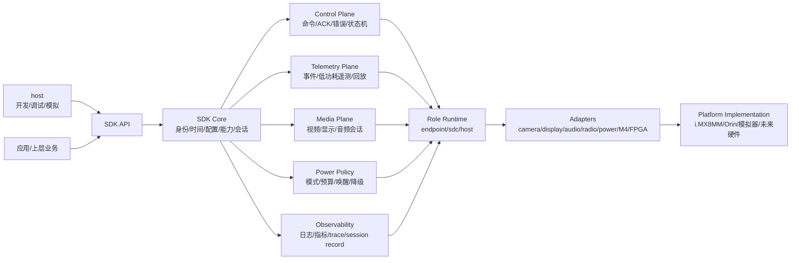
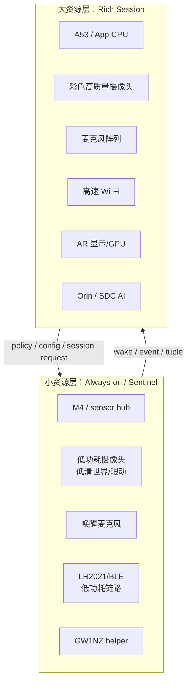

# SDK 设计概览与核心设计图

## 当前定位

Meiso Glass SDK 目前不追求立即可执行的完整 bring-up 文档，也不追求堆出大量后期 guide。当前第一目标是把 SDK 的模块、结构、边界和核心抽象梳理清楚，避免在实现前就发生文档漂移。

SDK 面向三类运行角色：

- `endpoint`：眼镜侧设备，负责传感器、显示、端侧功耗策略、低功耗遥测、高带宽视频或显示会话。
- `sdc`：空间计算设备，负责融合、AI、记录、回放、用户会话管理、私有网络和对 endpoint 的调度。
- `host`：开发和调试设备，负责配置、部署、模拟、抓日志、回放和测试。

SDK 必须平台中立，但不能假装硬件约束不存在。i.MX8MM、M4、Orin、LR2021、HM0360、GW1NZ、双 Wi-Fi、大小摄像头和大小麦克风都不应该硬编码进 core，却必须能在 SDK 的模型中被准确表达。

## 最核心的设计原则

1. SDK 先表达结构，再表达某块板的实现。
2. 所有硬件能力先抽象为 capability，再由 adapter 实现。
3. 所有长时间操作都按 session 管理，不按一次性命令管理。
4. 系统中的“大小资源”是一等概念：大资源负责高带宽和高质量，小资源负责低功耗和常驻感知。
5. endpoint、SDC、host 的边界不能因为某个临时 bring-up 脚本而被打穿。
6. 文档只保留能指导当前 SDK 设计的内容；使用指南和后期移植文档暂不维护。

## 核心结构图

## “大小系统”抽象

项目中存在大量成对资源：大小核、大小链路、大小摄像机、大小麦克风。SDK 不能把这些只当作普通设备列表，否则功耗策略和会话调度会失去中心。

SDK 使用 `tier` 表达资源层级：

| 资源组 | 小资源 | 大资源 | SDK 抽象 |
|---|---|---|---|
| 计算 | M4、sensor hub、FPGA helper | A53、Orin CPU/GPU/NPU | `compute_tier` |
| 网络/无线 | LR2021、BLE、低功耗命令链路 | Wi-Fi 私有高速链路、上游 Wi-Fi/以太网 | `link_tier` |
| 摄像头 | HM0360/HM01B0/眼动 hint sensor | rich color camera | `vision_tier` |
| 麦克风 | AAD wake mic、单麦低功耗监听 | 全阵列 PDM capture | `audio_tier` |
| 显示 | 状态/低亮度/低刷新提示 | AR display session、纹理/视频 | `display_tier` |
| 处理路径 | tile/ROI/tuple/event | frame/stream/session | `payload_tier` |

这个模型的意义：

- SDK 的 `power_mode` 不只是字符串，而是资源层级选择。
- SDK 的 `session` 不只是启动一个 pipeline，而是声明要占用哪些大/小资源。
- SDK 的 `capability` 不只是“有摄像头”，而是“有低功耗视觉 capability”或“有 rich video capability”。
- SDK 的调度器必须能从小资源升级到大资源，也能从大资源降级回小资源。

## SDK 模块图

```mermaid
flowchart LR
  subgraph Core["meiso_glass.core"]
    Identity[Identity]
    Timebase[Timebase]
    Capability[Capability Model]
    Resource[Resource Tier Model]
    Session[Session Model]
    Config[Config Schema]
  end

  subgraph Planes["协议平面"]
    Control[control]
    Telemetry[telemetry]
    Media[media]
    Events[events]
  end

  subgraph Runtime["运行时"]
    EndpointRuntime[endpoint runtime]
    SDCRuntime[sdc runtime]
    HostRuntime[host runtime]
  end

  subgraph Adapters["适配层"]
    Camera[camera]
    Audio[audio]
    Display[display]
    Radio[radio]
    Power[power]
    M4[M4 bridge]
    FPGA[FPGA bridge]
    Storage[storage]
  end

  Core --> Planes
  Planes --> Runtime
  Runtime --> Adapters
```

## 文档收敛规则

SDK 相关设计只维护以下三个文档：

- `SDK_DESIGN_OVERVIEW.md`：设计概览、核心图、边界、大小系统抽象。
- `SDK_SUBSYSTEM_DESIGN.md`：各子系统的详细设计案。
- `SDK_DEVELOPMENT_PLAN.md`：开发计划、当前进度、风险和下一步。

暂不维护独立 guide、ADR、checklist、protocol 细则、platform 文档和后期使用文档。以后只有当某个内容已经稳定到必须独立维护时，才从这三份文档中拆出新文档。
