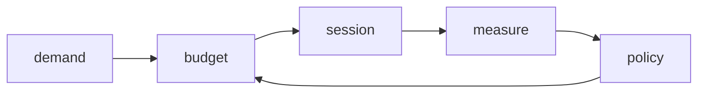

# SDK 设计概览与核心设计图

## 当前定位

Meiso Glass SDK 目前仍处于结构设计阶段。这个阶段最重要的不是把某一条真机链路写死，而是先定义清楚 SDK 如何表达硬件能力、会话、功耗和跨设备协作。

SDK 面向三类运行角色：

- `endpoint`：眼镜侧设备，负责传感器、显示、端侧功耗策略、低功耗遥测、高带宽视频或显示会话。
- `sdc`：空间计算设备，负责融合、AI、记录、回放、用户会话管理、私有网络和对 endpoint 的调度。
- `host`：开发和调试设备，负责配置、部署、模拟、抓日志、回放和测试。

SDK 必须平台中立，但不能假装硬件约束不存在。i.MX8MM、M4、Orin、LR2021、HM0360、GW1NZ、双 Wi-Fi、大小摄像头和大小麦克风都不应该硬编码进 core，却必须能被 SDK 的模型准确表达。

## 画图规则

Mermaid 图只用来说明关系，不承载完整清单。每张图最多表达一个问题，节点名保持短，不把长说明写进图里。详细内容放到表格和字段定义中。

## 核心结构图

图里的每一层只负责一类问题：

| 层 | 负责什么 | 不负责什么 |
|---|---|---|
| `roles` | `endpoint`、`sdc`、`host` 的职责边界 | 某块板子的设备路径 |
| `core model` | identity、capability、session、power budget、timebase | 具体 socket、GStreamer、BSP |
| `planes` | control、telemetry、media、power、observability | 直接驱动硬件 |
| `runtime` | 状态机、命令调度、session 生命周期 | 选择某个 vendor 分支 |
| `adapters` | camera、audio、display、radio、power、M4、FPGA 等硬件端口 | 定义产品策略 |
| `profiles` | 组合 adapter、默认策略、bring-up 差异 | 改写 core contract |

## 最核心的设计原则

1. SDK 先表达结构，再表达某块板的实现。
2. 所有硬件能力先抽象为 capability，再由 adapter 实现。
3. 所有长时间操作都按 session 管理，不按一次性命令管理。
4. 功耗是一等模型，不是 session 之后附带的一组日志字段。
5. 每个 adapter 必须声明自己的功耗等级、质量等级、时延等级和测量可信度。
6. endpoint、SDC、host 的边界不能因为某个临时 bring-up 脚本而被打穿。
7. 文档只保留能指导当前 SDK 设计的内容；使用指南和后期移植文档暂不维护。

## “大小系统”抽象

项目中存在大量成对资源：大小核、大小链路、大小摄像机、大小麦克风。SDK 不能把这些只当作普通设备列表，否则功耗策略和会话调度会失去中心。

SDK 使用 `resource_tier` 表达资源层级：

| 资源组 | 小资源 | 大资源 | SDK 抽象 |
|---|---|---|---|
| 计算 | M4、sensor hub、FPGA helper | A53、Orin CPU/GPU/NPU | `compute_tier` |
| 网络/无线 | LR2021、BLE、低功耗命令链路 | Wi-Fi 私有高速链路、上游 Wi-Fi/以太网 | `link_tier` |
| 摄像头 | HM0360/HM01B0/眼动 hint sensor | rich color camera | `vision_tier` |
| 麦克风 | AAD wake mic、单麦低功耗监听 | 全阵列 PDM capture | `audio_tier` |
| 显示 | 状态/低亮度/低刷新提示 | AR display session、纹理/视频 | `display_tier` |
| 处理路径 | tile、ROI、tuple、event | frame、stream、session | `payload_tier` |

这个模型的意义：

- `power_mode` 不是字符串，而是允许哪些 resource tier 和哪些 power level 组合。
- `session` 不只是启动一个 pipeline，而是声明要占用哪些大/小资源。
- `capability` 不只是“有摄像头”，而是“在某些功耗等级下能提供某种信息”。
- 调度器必须能从小资源升级到大资源，也能从大资源降级回小资源。

## 功耗模型概览

早期文档只提了 `power_mode`，这不够。SDK 需要同时表达以下四件事：

| 概念 | 解决的问题 | 示例 |
|---|---|---|
| `power_state` | 设备是否供电、挂起、活动 | `off`、`suspended`、`idle`、`active` |
| `power_level_u8` | 在 SDK 内排序功耗强度 | `0` 到 `255` |
| `power_dimensions` | 功耗不是一条轴，需要拆维度 | duty、throughput、quality、latency、thermal |
| `measured_power` | 已测得的真实数据 | `mw_avg`、`uj_per_frame`、`wake_latency_ms` |

`power_level_u8` 是紧凑的策略等级，不直接等于 mW。真实功耗必须通过平台测量表补充。这样做的原因是：Linux Energy Model 也区分真实微瓦和抽象 scale；Android PowerStats 也按 power entity 和 state residency 记录数据；Zephyr 和 Linux runtime PM 都把设备状态转换当作驱动和系统协同问题，而不是单个数值。

## 8-bit 功耗等级标准草案

`power_level_u8` 使用 `0..255`，越大表示越高的资源占用、能量风险或热风险。SDK 只规定分段语义，不要求每个 adapter 支持 256 个离散档位。一个 adapter 可以只支持 `[0, 32, 64, 128, 192]`，也可以支持更细档。

| 范围 | 名称 | 默认含义 |
|---|---|---|
| `0` | `off` | 断电或不可用，不保留运行状态 |
| `1..15` | `retention` | 保留少量状态，不能主动采样 |
| `16..31` | `wake_ready` | 可被唤醒或可产生中断，吞吐接近 0 |
| `32..63` | `sentinel` | 常驻低功耗感知、低频采样、事件触发 |
| `64..95` | `sparse_capture` | 稀疏采样、低分辨率、低 fps、tuple 输出 |
| `96..127` | `local_process` | 本地预处理、ROI/tile、低码率事件流 |
| `128..159` | `stream_low` | 低/中等码率连续流，允许明显降质 |
| `160..191` | `stream_rich` | rich video/audio/display，会唤醒大资源 |
| `192..223` | `stream_peak` | 高分辨率、高刷新、多路或低压缩 |
| `224..255` | `debug_boost` | 校准、raw dump、压测、热风险高，不作为默认产品模式 |

如果未来需要 128 档，可以保留同一语义，把最低 7 bit 作为等级，最高 bit 作为 flag。但当前建议 wire format 直接保留 8 bit，避免之后扩展困难。

## 多维功耗等级

单一 `power_level_u8` 只能用于排序，不能解释为什么高或低。每个 adapter 的 capability 和 status 应再暴露维度：

| 字段 | 范围 | 含义 |
|---|---|---|
| `state_level_u8` | `0..255` | 供电/挂起/活动强度 |
| `duty_level_u8` | `0..255` | active time、采样频率、radio airtime |
| `throughput_level_u8` | `0..255` | 像素率、音频采样率、bitrate、packet rate |
| `quality_level_u8` | `0..255` | 分辨率、bit depth、SNR、刷新率、压缩损失 |
| `latency_level_u8` | `0..255` | 越高表示越低时延、更快唤醒、更高常驻成本 |
| `thermal_level_u8` | `0..255` | 热压力或热预算消耗 |
| `confidence_level_u8` | `0..255` | 等级来自估算、bench、rail measurement 还是量产测量 |

调度器可以先用 `power_level_u8` 做粗排序，再用维度判断是否符合 session 约束。例如一个摄像头可能 `state_level_u8=160`，因为传感器和 CSI 已经工作；但 `throughput_level_u8=48`，因为只传 ROI tuple。

## 功耗策略闭环

闭环解释：

- `demand`：上层要什么，例如 eye hint、rich video、display AR。
- `budget`：当前可用能量、热、时延和链路预算。
- `session`：实际启动的 adapter 组合。
- `measure`：rail、runtime、packet、latency、drop、temperature。
- `policy`：根据测量结果继续、降级、升级或停止。

## 信息量和功耗要解耦

摄像机尤其容易混淆。SDK 必须区分：

- `capture_cost`：传感器、MIPI/parallel interface、ISP、VPU、内存写入消耗。
- `compute_cost`：ROI、tile、feature、encode、AI prefilter 消耗。
- `egress_cost`：无线、以太网、BLE/LR、USB 或共享内存传输消耗。
- `information_level`：输出给 SDC 或 host 的信息丰富度。

示例：

| 场景 | capture_cost | egress_cost | information_level |
|---|---:|---:|---:|
| sensor off | 0 | 0 | 0 |
| motion interrupt | 低 | 极低 | 事件 |
| lowfi 160x120 5fps 本地 ROI | 中低 | 低 | tuple/tile |
| 720p 30fps H.264 | 高 | 高 | stream |
| full raw calibration | 很高 | 很高 | raw frame |

因此 `CameraAdapter` 不能只声明 `fps` 和 `resolution`。它还要声明采集、处理、传输三段的预算和允许输出的信息形态。

## 文档收敛规则

SDK 相关设计只维护以下三个文档：

- `SDK_DESIGN_OVERVIEW.md`：设计概览、短图、边界、大小系统抽象、功耗总模型。
- `SDK_SUBSYSTEM_DESIGN.md`：各子系统的详细设计案，特别是 adapter、media、telemetry、power policy。
- `SDK_DEVELOPMENT_PLAN.md`：开发计划、当前进度、风险、未决问题和下一步。

暂不维护独立 guide、ADR、checklist、protocol 细则、platform 文档和后期使用文档。以后只有当某个内容已经稳定到必须独立维护时，才从这三份文档中拆出新文档。

## 本轮调研依据

本轮文档更新参考了这些方向：

- Linux runtime PM：设备 runtime suspend/resume、usage count、autosuspend 思路。
- Zephyr Device PM：device state、device runtime PM、device dependency 和 busy 状态。
- Android PowerStats HAL：power entity、state residency、累计能量统计。
- Linux Energy Model：performance state 到 power cost table，可以是真实微瓦，也可以是抽象 scale。
- Linux `hwmon` 和 `powercap`：电压、电流、功率和 power zone 的用户态观测接口。
- V4L2 和 W3C Media Capture：摄像头能力需要表达 pixel format、frame size、frame interval、width、height、frameRate。
- MIPI CSI-2/DSI-2：camera/display 低功耗路径、lane/bandwidth、adaptive refresh、AOSC 等方向。
- BLE/Wi-Fi 低功耗资料：radio 功耗主要受 TX power、连接/广播间隔、airtime、payload size、wake interval 影响。

这些资料只作为设计约束来源，不表示 SDK 会直接绑定某个 OS、协议栈或厂商实现。
