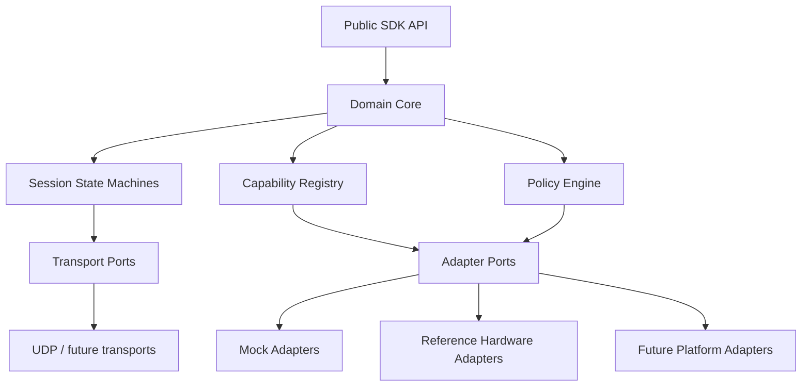
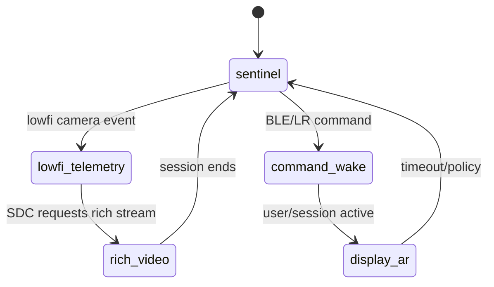

# SDK 子系统详细设计案

## 设计目标

本文件定义 SDK 当前应该具备的结构，而不是某块开发板的最终实现方式。目标是先形成清晰的模块边界，使后续 i.MX8MM、Orin、Android、embedded Linux、模拟器和未来硬件都能沿同一套结构接入。

## 总体分层



分层规则：

- `Public SDK API` 面向应用、dashboard 和测试。
- `Domain Core` 只定义身份、时间、能力、资源、会话和错误模型。
- `Session State Machines` 负责 start/stop/pause/resume/fail/recover。
- `Transport Ports` 只定义消息如何进出，不绑定 UDP。
- `Adapter Ports` 只定义硬件能力，不绑定 BSP、设备节点或芯片。
- `Reference Hardware Adapters` 可以很具体，但不能反向污染 core。

## 核心领域模型

### Identity

每个实体至少包含：

- `role`：`endpoint`、`sdc`、`host`。
- `device_id`：稳定设备 ID。
- `instance_id`：当前进程或本次启动实例 ID。
- `platform_id`：平台 profile ID。
- `capability_revision`：能力声明版本。

### Resource Tier

SDK 应使用 tier 表达大小资源：

```text
compute_tier: sentinel | application | sdc
link_tier: low_power | high_bandwidth | upstream
vision_tier: wake | lowfi | eye_hint | rich
audio_tier: wake | capture
display_tier: none | status | ar
payload_tier: event | tuple | packet | stream
```

这些 tier 不是 UI 标签，而是调度、功耗预算和 session 验收的输入。

### Capability

Capability 是 SDK 判断“能不能做某事”的唯一入口。

建议字段：

```text
capability_id
family
tier
role_owner
availability
limits
dependencies
metrics
adapter_id
validation_state
```

`validation_state` 初始只需要：

- `declared`：配置声明存在。
- `mocked`：mock 可运行。
- `detected`：真实设备可检测。
- `smoke_tested`：真实链路跑通过。
- `measured`：有功耗、延迟或质量数据。
- `blocked`：已知阻塞。

### Session

所有非瞬时操作都必须是 session：

- rich video session。
- lowfi vision session。
- eye hint session。
- audio capture session。
- display session。
- power mode session。
- firmware/update/debug session。

Session 必须包含：

```text
session_id
session_type
owner_role
requested_capabilities
resource_tiers
state
start_time
last_transition
policy
metrics
error
```

基础状态：

```text
idle -> starting -> running -> stopping -> stopped
starting -> failed
running -> degraded
degraded -> recovering -> running
running -> failed
```

## Control Plane

Control plane 负责命令、状态机、ACK、错误和能力查询。它不负责直接表达视频帧、传感器样本或大量遥测。

### 命令模型

`msg_type` 不应同时承担 envelope 类型和具体命令名。建议固定：

```text
msg_type: command | ack | error | event | heartbeat
payload.command.name: ping | health | start_session | stop_session | query_capability | set_policy
```

### 错误模型

错误必须结构化：

```text
code
message
retryable
details
failed_state
related_session_id
```

### ACK 规则

ACK 至少关联：

- 原始 `msg_id`。
- 原始 `seq`。
- `session_id`，如果命令创建或影响 session。
- 当前状态。
- 是否幂等命中。

## Telemetry Plane

Telemetry plane 表达低功耗事件、稀疏 tuple、功耗状态、链路统计和回放数据。早期可以用 JSON 事件开发，但低功耗路径必须朝二进制 packet 收敛。

### Payload Family

第一批必须设计的 payload family：

| family | 对应大小系统 | 说明 |
|---|---|---|
| `imu_sample` | 小传感器 | 加速度、角速度、时间戳、置信度 |
| `lowfi_vision_tile` | 小摄像机 | ROI、tile 统计、motion hint |
| `eye_hint_tuple` | 小眼动 | pupil/blob/glint/blink/confidence |
| `power_rail_sample` | 小功耗观测 | rail、电压、电流、功率、采样源 |
| `link_stats` | 大小链路 | RSSI、丢包、airtime、速率 |

### 时间

SDK 必须区分：

- monotonic time：延迟、排序、session 统计。
- realtime：人类日志关联。
- source time：传感器或 M4/FPGA 提供的原始时间。

## Media Plane

Media plane 管理高带宽会话，不只管理 GStreamer 命令。

### Rich Video Session

目标结构：

```text
source capability -> encoder capability -> packetizer/transport -> receiver -> recorder/display
```

它可以由 `videotestsrc` 做 smoke test，但 SDK 设计上必须能表达：

- rich color camera。
- CSI/V4L2/Android camera source。
- hardware encoder 或 software encoder。
- RTP/UDP 或未来传输。
- 延迟、丢帧、码率、温度和功耗指标。

### Display Session

Display session 是 SDC 到 endpoint 的大资源会话，不应被混进普通 control message。

它需要表达：

- display tier。
- 亮度、刷新、分辨率。
- 内容类型：HUD、video、texture、debug。
- 是否需要唤醒大核。
- 退出后的降级策略。

## Power Policy

Power policy 是 SDK 的核心，不是后期附加项。

建议 power mode：

```text
off
ship
sentinel
lowfi_telemetry
command_wake
rich_video
display_ar
debug
```

每个 mode 必须声明：

- 允许使用哪些 resource tier。
- 哪些 capability 可运行。
- 唤醒源。
- 降级路径。
- 必须记录哪些 metrics。

大小资源调度示例：



## Adapter Layer

Adapter 是硬件和 SDK 之间的端口。每个 adapter family 都必须包含：

- capability discovery。
- start/stop 或 read/write 操作。
- structured status。
- structured error。
- metrics。
- contract tests。

第一批 adapter family：

| Adapter | 大小系统角色 |
|---|---|
| `CameraAdapter` | 大摄像机、小摄像机、眼动 hint |
| `AudioAdapter` | 唤醒麦、全阵列麦 |
| `DisplayAdapter` | 状态显示、AR 显示 |
| `VideoEncoderAdapter` | 软件编码、硬件 VPU |
| `RadioAdapter` | 小链路 LR/BLE、大链路 Wi-Fi 边界 |
| `PowerAdapter` | 模式、rail、预算、采样 |
| `M4Bridge` | 小核控制、唤醒、mailbox |
| `FpgaBridge` | 小视觉 helper、FIFO、bitstream/status |
| `StorageAdapter` | 日志、回放、记录 |

## Config/Profile

Profile 不应该只写 IP 和端口。它应该声明平台能力，而不是替代硬件检测。

建议结构：

```text
profile_id
role
platform_family
network_paths
capabilities
adapters
default_policy
validation_state
```

Profile 的职责：

- 告诉 runtime 应该尝试装配哪些 adapter。
- 告诉测试哪些能力只是声明、哪些已经验证。
- 告诉上层 API 当前平台能跑哪些 session。

## Observability

SDK 必须从一开始记录 session 级证据，而不是后期补日志。

每个 session 至少记录：

- request。
- capability snapshot。
- state transitions。
- metrics samples。
- errors。
- stop reason。
- validation result。

这不是使用指南，而是 SDK 模型的一部分。

## 建议源码结构

当前不要求立刻重构实现，但推荐目标结构如下：

```text
src/meiso_glass/
  core/          identity, timebase, capability, resource tier, session
  control/       command, ack, error, heartbeat, state machine
  telemetry/     packet header, payload family, replay event
  media/         media session model, video/display/audio contracts
  power/         power mode, policy, budget, rail sample
  adapters/      adapter protocols and mock contracts
  runtime/       endpoint/sdc/host composition interfaces
  simulation/    fake endpoint, fake sdc, fake sensors
```

现有实现可以逐步迁移，不需要为了目录整洁而打断当前开发。
