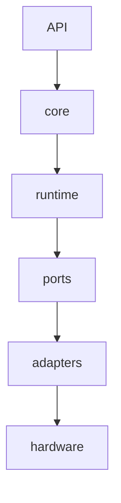
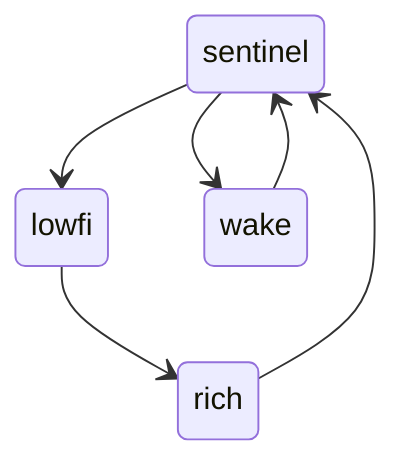

# SDK 子系统详细设计案

## 设计目标

本文件定义 SDK 当前应该具备的结构，而不是某块开发板的最终实现方式。目标是先形成清晰的模块边界，使后续 i.MX8MM、Orin、Android、embedded Linux、模拟器和未来硬件都能沿同一套结构接入。

这版重点补强功耗模型和 adapter contract。以前只说“大资源/小资源”，还不够指导实现。现在需要把每个 adapter 的功耗等级、能力边界、信息输出等级和测量可信度作为 contract 的一部分。

## 总体分层



分层规则：

- `API` 面向应用、dashboard 和测试。
- `core` 只定义 identity、timebase、capability、session、power、error。
- `runtime` 负责状态机、命令调度、session 生命周期。
- `ports` 定义 transport、camera、audio、display、radio、power、M4、FPGA 等接口。
- `adapters` 可以绑定 BSP、设备节点、进程、socket、driver、firmware。
- `hardware` 是真实设备或 mock/simulator。

## 核心领域模型

### Identity

每个实体至少包含：

| 字段 | 说明 |
|---|---|
| `role` | `endpoint`、`sdc`、`host` |
| `device_id` | 稳定设备 ID |
| `instance_id` | 当前进程或本次启动实例 ID |
| `platform_id` | 平台 profile ID |
| `capability_revision` | 能力声明版本 |

### Capability

Capability 是 SDK 判断“能不能做某事”的唯一入口。

建议字段：

```text
capability_id
family
role_owner
resource_tier
power_profile
quality_profile
latency_profile
availability
limits
dependencies
metrics
adapter_id
validation_state
```

`validation_state` 初始只需要：

- `declared`：配置声明存在。
- `mocked`：mock 可运行。
- `detected`：真实设备可检测。
- `smoke_tested`：真实链路跑通过。
- `measured`：有功耗、延迟或质量数据。
- `blocked`：已知阻塞。

### Session

所有非瞬时操作都必须是 session：

- rich video session。
- lowfi vision session。
- eye hint session。
- audio capture session。
- display session。
- power mode session。
- firmware/update/debug session。

Session 必须包含：

```text
session_id
session_type
owner_role
requested_capabilities
resource_tiers
power_budget
information_budget
state
start_time
last_transition
policy
metrics
error
```

基础状态：

```text
idle -> starting -> running -> stopping -> stopped
starting -> failed
running -> degraded
degraded -> recovering -> running
running -> failed
```

## Power Model

### 为什么要把功耗放进 adapter

功耗不是只有整机 mode。一个 session 的真实消耗由多个 adapter 的状态叠加产生：

- 摄像头传感器、接口、ISP、memory copy。
- 编码器或 VPU。
- radio airtime 和 TX power。
- display brightness、refresh rate、content pattern。
- M4/FPGA wake interval。
- storage flush。
- telemetry/logging 自身。

如果只在 `PowerAdapter` 中记录整机状态，调度器无法判断“为了一个眼动 tuple 是否值得启动 rich camera”，也无法比较“本地 ROI 处理”和“直接传低清帧”哪个更省。

### Adapter Power Profile

每个 adapter 都必须暴露 `power_profile`。最小结构：

```text
profile_version
scheme: u8
supported_levels
default_level
current_level
state_level_u8
duty_level_u8
throughput_level_u8
quality_level_u8
latency_level_u8
thermal_level_u8
confidence_level_u8
measured_points
unknowns
```

`supported_levels` 不要求 256 个档都支持。硬件只需要列出自己实际支持的点，例如 `[0, 16, 32, 64, 96, 128]`。

`measured_points` 是 profile 中最重要的部分，后续应逐步补齐：

```text
level
state
settings
mw_avg
mw_peak
wake_latency_ms
settle_latency_ms
uj_per_event
uj_per_frame
bytes_per_second
sample_window_ms
measurement_source
confidence_level_u8
```

`measurement_source` 建议值：

- `declared_only`
- `datasheet_estimate`
- `driver_counter`
- `os_powerstats`
- `rail_probe`
- `bench_fixture`
- `product_calibrated`

### 8-bit 等级和真实功耗的关系

`power_level_u8` 是排序和策略用字段，不直接等于 mW。真实 mW 与硬件、电压、温度、驱动、链路质量、负载有关。

设计约束：

- 同一个 adapter 内，level 越高默认不能比更低 level 更省，除非 profile 明确说明反例。
- 不同 adapter family 之间，level 只能粗略比较，不能拿 `CameraAdapter:128` 和 `RadioAdapter:128` 直接换算 mW。
- 能测 mW 时必须记录 mW；不能测时可以先用抽象 level。
- `confidence_level_u8` 低时，policy 只能做保守调度，不能做精细预算。

### 默认等级段

| 范围 | 含义 | Policy 默认态度 |
|---|---|---|
| `0` | off | 只有明确请求才启动 |
| `1..31` | retention / wake_ready | 可以常驻 |
| `32..63` | sentinel | 可以长时间运行，但必须采样验证 |
| `64..95` | sparse_capture | 允许短周期或低 duty |
| `96..127` | local_process | 需要 session 预算 |
| `128..159` | low stream | 需要 SDC 或用户意图 |
| `160..191` | rich stream | 默认限时，必须可降级 |
| `192..223` | peak stream | 只用于明确 high quality session |
| `224..255` | debug / boost | 不作为产品默认路径 |

## Adapter Family 设计

### CameraAdapter

Camera 的功耗不能只看分辨率和 fps。需要拆成三段：

| 维度 | 说明 |
|---|---|
| `capture_level_u8` | sensor、clock、exposure、pixel rate、interface |
| `process_level_u8` | ISP、ROI、tile、feature、encode 前处理 |
| `egress_level_u8` | 输出到 SDC/host/radio 的数据量 |
| `information_level_u8` | 输出信息丰富度，不等于传输字节数 |

Camera capability 建议字段：

```text
sensor_role: wake | lowfi | eye_hint | rich | debug
pixel_formats
frame_sizes
frame_intervals
crop_modes
binning_modes
roi_modes
local_feature_modes
transport_outputs
power_profile
```

参考 V4L2 和 W3C Media Capture 的做法，SDK 应能表达 `pixel_format`、`width`、`height`、`frame_interval` 或 `frameRate`。但 SDK 不应该只复刻 V4L2，因为眼镜端还要表达 ROI、tile、event、tuple、隐私和无线预算。

Camera 默认档位草案：

| level | 名称 | 典型能力 | 典型输出 |
|---:|---|---|---|
| `0` | `off` | sensor off | none |
| `16` | `standby` | register/I2C 可访问 | status |
| `32` | `motion_wake` | 中断或低频光流 | event |
| `64` | `lowfi_sparse` | 小图、低 fps、crop/binning | ROI/tile |
| `96` | `lowfi_continuous` | 低清连续感知 | tuple/packet |
| `128` | `preview_stream` | 中等分辨率 H.264/RAW preview | low stream |
| `160` | `rich_video` | 720p/1080p 级 session | stream |
| `192` | `multi_or_high_rate` | 多路/高 fps/高码率 | stream |
| `224` | `raw_debug` | full raw/calibration | raw dump |

需要明确的策略：

- 采集等级高，不代表必须传输高信息量。可以高采集、本地低信息输出。
- 传输等级低，不代表传感器低功耗。比如 raw sensor 开着但只传 motion tuple。
- `information_level_u8` 需要和 privacy/security 一起设计，低信息输出可能是功耗选择，也可能是隐私选择。

### VideoEncoderAdapter

Encoder 的功耗主要由输入像素率、编码复杂度、码率、I/P/B frame 策略、硬件/软件路径决定。

建议字段：

```text
codec
profile
input_pixel_rate
target_bitrate
gop
latency_mode
hardware_path
power_profile
```

默认等级：

| level | 名称 | 说明 |
|---:|---|---|
| `0` | `off` | encoder 不运行 |
| `64` | `thumbnail_or_tuple` | 只处理低清或 feature 输出 |
| `128` | `low_latency_low_bitrate` | 低码率实时流 |
| `160` | `rich_realtime` | rich H.264/H.265 实时流 |
| `192` | `high_quality_record` | 更高码率或更高质量 |
| `224` | `debug_raw_or_stress` | raw dump、压测、校准 |

未决问题：硬件 VPU 通常比 CPU 软件编码省电，但如果唤醒额外电源域或导致内存带宽增加，实际差异需要 rail measurement。

### RadioAdapter

Radio 功耗核心不是“协议名”，而是 airtime、TX power、wake interval、payload size、重传和监听窗口。

建议字段：

```text
link_role: low_power_control | telemetry | media | upstream
phy
tx_power_dbm
airtime_budget_ms_per_s
wake_interval_ms
connection_interval_ms
payload_budget_bps
retry_policy
power_profile
```

默认等级：

| level | 名称 | 典型能力 |
|---:|---|---|
| `0` | `radio_off` | 断开 |
| `16` | `wake_listen` | 极低 duty 监听或中断 |
| `32` | `advertise_sparse` | 低频广播/发现 |
| `64` | `control_link` | command、heartbeat、低频 telemetry |
| `96` | `telemetry_burst` | tuple/packet burst |
| `128` | `low_bandwidth_stream` | 低码率持续传输 |
| `160` | `media_stream` | 视频或高频 sensor |
| `192` | `high_bandwidth` | 高吞吐 Wi-Fi/以太网侧 |
| `224` | `debug_rf` | RF 调试、扫描、压测 |

BLE 资料显示，TX power、advertising/connection interval、peripheral latency、PHY 和 payload size 都会明显影响电流。Wi-Fi 侧也要关心 power save、TWT、listen interval 和 active window。SDK 不应该把 `link_tier=low_power` 简化成某个固定 radio。

### DisplayAdapter

Display 的功耗受 brightness、refresh rate、resolution、pixel content、command/video mode、GPU composition、foveation、display memory 影响。

建议字段：

```text
display_role: status | hud | ar | debug
brightness_nits_or_pct
refresh_rate_hz
resolution
content_type
update_region
foveation_mode
power_profile
```

默认等级：

| level | 名称 | 典型能力 |
|---:|---|---|
| `0` | `off` | display off |
| `16` | `retention` | panel state retained |
| `32` | `status_low_refresh` | 状态提示、低刷新 |
| `64` | `hud_sparse` | 小区域 HUD |
| `128` | `ar_low_refresh` | AR 低刷新 |
| `160` | `ar_interactive` | 交互 AR |
| `192` | `video_or_high_brightness` | 视频、高亮或高刷新 |
| `224` | `calibration_debug` | 色彩/亮度/校准 |

MIPI DSI-2 的 adaptive refresh 和 video-to-command mode 方向说明，显示链路不应只按“开/关”建模。Android 对高刷新率也明确把功耗、发热和实际帧率纳入策略。

### AudioAdapter

Audio 要区分唤醒、关键词、低码率事件、全阵列采集。

建议字段：

```text
audio_role: wake | voice_hint | capture | beamforming | debug
sample_rate_hz
channels
bit_depth
vad_mode
keyword_mode
power_profile
```

默认等级：

| level | 名称 | 典型能力 |
|---:|---|---|
| `0` | `off` | mic off |
| `16` | `wake_ready` | AAD 或外部 wake |
| `32` | `vad` | voice activity event |
| `64` | `keyword_or_hint` | keyword/hint |
| `96` | `low_rate_capture` | 低采样率 capture |
| `128` | `voice_stream` | 单/双麦语音 |
| `160` | `array_capture` | 阵列或 beamforming |
| `224` | `raw_debug` | 多通道 raw dump |

### ComputeAdapter

Compute 需要表达 CPU、MCU、NPU、GPU、DSP、FPGA helper 的不同能效曲线。

建议字段：

```text
compute_role: sentinel | app_cpu | ai | gpu | dsp | fpga
performance_points
memory_bandwidth_budget
accelerator_context
power_profile
```

等级需要和 Linux Energy Model 类似：同一个 performance domain 应有多个 performance state，每个 state 可以有 `frequency`、`power`、`cost` 或抽象 cost。

### M4Bridge

M4Bridge 是低功耗策略的关键，不应只是串口/mailbox 工具。

建议字段：

```text
bridge_role: wake | sensor_hub | power_policy | radio_scheduler | fpga_control
mailbox_rate_hz
shared_memory_bytes
wake_sources
firmware_state
power_profile
```

默认等级：

| level | 名称 | 典型能力 |
|---:|---|---|
| `0` | `off` | bridge unavailable |
| `16` | `mailbox_ready` | 可被 host/A53 查询 |
| `32` | `sentinel_control` | 低频 sensor/radio 调度 |
| `64` | `event_collector` | 聚合事件、发 wake |
| `96` | `lowfi_manager` | 管理低功耗视觉或 FPGA |
| `128` | `firmware_update` | OTA/debug session |

### FpgaBridge

FPGA helper 只有在 energy per useful telemetry frame 优于 M4/A53 时才值得启用。

建议字段：

```text
fpga_role: lowfi_vision | packet_filter | timing | debug
bitstream_id
clock_rate
input_rate
output_tuple_rate
fifo_depth
power_profile
```

默认等级：

| level | 名称 | 典型能力 |
|---:|---|---|
| `0` | `off` | unconfigured/off |
| `16` | `configured_idle` | bitstream retained |
| `64` | `low_rate_filter` | 低频 filter |
| `96` | `tile_or_roi` | tile/ROI tuple |
| `128` | `continuous_lowfi` | 连续低功耗预处理 |
| `192` | `debug_capture` | FIFO/raw/debug |

### PowerAdapter

PowerAdapter 不只是读电量。它要把整机、rail、adapter profile 和 session budget 连起来。

建议字段：

```text
power_entities
rails
sampling_modes
state_residency
energy_counters
budget_policy
power_profile
```

PowerAdapter 自己也有功耗：高频采样、电流计、log flush 都会影响电池。采样等级需要记录。

| level | 名称 | 典型能力 |
|---:|---|---|
| `0` | `off` | 不采样 |
| `16` | `coarse_battery` | 低频电池/电压 |
| `32` | `rail_summary` | 低频 rail summary |
| `64` | `session_sample` | session 期间采样 |
| `96` | `high_rate_probe` | 短时高频采样 |
| `160` | `bench_fixture` | 外部量测夹具 |

### StorageAdapter

Storage 功耗常被忽略，但日志和 raw dump 会带来明显写放大。

建议字段：

```text
storage_role: log | replay | recording | model_cache | debug_dump
write_rate_bps
flush_policy
retention_policy
power_profile
```

默认等级：

| level | 名称 | 典型能力 |
|---:|---|---|
| `0` | `off` | 不写 |
| `16` | `metadata_only` | session summary |
| `32` | `event_log` | sparse event |
| `64` | `telemetry_replay` | low-rate replay |
| `128` | `media_record` | compressed media |
| `192` | `raw_dump` | high-rate raw/debug |

## Control Plane

Control plane 负责命令、状态机、ACK、错误和能力查询。它不负责直接表达视频帧、传感器样本或大量遥测。

建议将 envelope 和 command payload 分开：

```text
msg_type: command | ack | error | event | heartbeat
payload.command.name: ping | health | start_session | stop_session | query_capability | set_policy
```

ACK 至少关联：

- 原始 `msg_id`。
- 原始 `seq`。
- `session_id`，如果命令创建或影响 session。
- 当前状态。
- 是否幂等命中。

错误必须结构化：

```text
code
message
retryable
details
failed_state
related_session_id
```

## Telemetry Plane

Telemetry plane 表达低功耗事件、稀疏 tuple、功耗状态、链路统计和回放数据。早期可以用 JSON 事件开发，但低功耗路径必须朝二进制 packet 收敛。

第一批 payload family：

| family | 对应大小系统 | 说明 |
|---|---|---|
| `imu_sample` | 小传感器 | 加速度、角速度、时间戳、置信度 |
| `lowfi_vision_tile` | 小摄像机 | ROI、tile 统计、motion hint |
| `eye_hint_tuple` | 小眼动 | pupil、blob、glint、blink、confidence |
| `power_rail_sample` | 功耗观测 | rail、电压、电流、功率、采样源 |
| `link_stats` | 大小链路 | RSSI、丢包、airtime、速率 |
| `adapter_power_state` | 所有 adapter | current level、state residency、confidence |

时间必须区分：

- monotonic time：延迟、排序、session 统计。
- realtime：人类日志关联。
- source time：传感器或 M4/FPGA 提供的原始时间。

## Media Plane

Media plane 管理高带宽会话，不只管理 GStreamer 命令。

Rich video session 的结构：

```text
source capability -> process capability -> encoder capability -> transport -> receiver
```

它可以由 `videotestsrc` 做 smoke test，但 SDK 设计上必须能表达：

- rich color camera。
- CSI/V4L2/Android camera source。
- hardware encoder 或 software encoder。
- RTP/UDP 或未来传输。
- 延迟、丢帧、码率、温度和功耗指标。
- capture 和 egress 信息量不一致的情况。

Display session 是 SDC 到 endpoint 的大资源会话，不应被混进普通 control message。

## Power Policy

Power policy 是 SDK 的核心，不是后期附加项。

建议 power mode：

| mode | 允许资源 | 默认限制 |
|---|---|---|
| `off` | 无 | 只允许 boot/wake 入口 |
| `ship` | 极少 rail | 不允许运行 session |
| `sentinel` | M4、wake mic、低功耗 sensor、低 duty radio | 长时间运行，必须低 confidence 风险 |
| `lowfi_telemetry` | lowfi camera、M4/FPGA、low-power link | 输出 event/tuple/tile |
| `command_wake` | control link、A53 短醒 | 限时，必须回落 |
| `rich_video` | rich camera、encoder、高速 link、SDC | session 限时，必须记录 power |
| `display_ar` | display、GPU/compose、高速 link | 受亮度/刷新/热限制 |
| `debug` | 任意资源 | 不作为产品默认策略 |

状态转移用短图表示：



图里省略错误和超时；实现必须处理 failed、degraded、recovering。

## Config/Profile

Profile 不应该只写 IP 和端口。它应该声明平台能力，而不是替代硬件检测。

建议结构：

```text
profile_id
role
platform_family
network_paths
capabilities
adapters
default_policy
measurement_sources
validation_state
unknowns
```

Profile 的职责：

- 告诉 runtime 应该尝试装配哪些 adapter。
- 告诉测试哪些能力只是声明、哪些已经验证。
- 告诉上层 API 当前平台能跑哪些 session。
- 告诉 power policy 哪些 level 是估算，哪些 level 已测。

## Observability

SDK 必须从一开始记录 session 级证据，而不是后期补日志。

每个 session 至少记录：

- request。
- capability snapshot。
- adapter power snapshot。
- state transitions。
- metrics samples。
- errors。
- stop reason。
- validation result。

功耗相关 metrics 建议：

```text
session_mw_avg
session_mw_peak
adapter_mw_avg
adapter_level_u8
adapter_state_residency_ms
uj_per_event
uj_per_frame
bytes_per_joule
wake_latency_ms
settle_latency_ms
thermal_level_u8
confidence_level_u8
```

OpenTelemetry 的 traces、metrics、logs 分层可以作为 observability 参考，但 SDK 不需要一开始就引入完整 OTel 依赖。

## 建议源码结构

当前不要求立刻重构实现，但推荐目标结构如下：

```text
src/meiso_glass/
  core/          identity, timebase, capability, session, error
  power/         level, dimension, budget, profile, measurement
  control/       command, ack, error, heartbeat, state machine
  telemetry/     packet header, payload family, replay event
  media/         media session model, video/display/audio contracts
  adapters/      adapter protocols and mock contracts
  runtime/       endpoint/sdc/host composition interfaces
  simulation/    fake endpoint, fake sdc, fake sensors
```

现有实现可以逐步迁移，不需要为了目录整洁而打断当前开发。

## 未决问题

这些问题不需要现在一次定稿，但必须被记录：

- `power_level_u8` 是否需要跨 adapter family 可比，还是只保证同 family 内单调。
- 128 档是否足够。如果采用 128 档，最高 bit 是否用于 `estimated/measured`、`critical` 或 `reserved`。
- `information_level_u8` 是否应该独立成为 session 字段，还是只在 camera/radio/media 中出现。
- 低功耗 camera 的 ROI/tile 计算放在 sensor、M4、FPGA 还是 A53，取决于真实 energy per useful event，需要测。
- 对 OLED/LCOS/MicroLED 等不同显示技术，brightness/content/refresh 的功耗模型差异很大，SDK 只能先定义字段，不能假设统一公式。
- Wi-Fi、BLE、LR、私有 radio 的 airtime 和 wake interval 字段可以统一，但可靠性、重传和连接维护成本需要分别建模。
- PowerAdapter 的采样本身会耗电，采样频率和测量精度需要加入 budget。
- 真实 rail 不一定能分辨每个 adapter 的功耗，可能只能用整机差分或 external fixture 估算。

## 调研链接

- Linux Runtime PM: https://docs.kernel.org/power/runtime_pm.html
- Linux Energy Model: https://static.lwn.net/kerneldoc/power/energy-model.html
- Linux Powercap: https://docs.kernel.org/power/powercap/powercap.html
- Linux hwmon sysfs: https://www.kernel.org/doc/Documentation/hwmon/sysfs-interface
- Zephyr Device PM: https://docs.zephyrproject.org/latest/services/pm/device.html
- Android PowerStats HAL: https://source.android.com/docs/core/power/power-stats-hal
- V4L2 frame intervals: https://www.kernel.org/doc/html/v4.9/media/uapi/v4l/vidioc-enum-frameintervals.html
- W3C Media Capture: https://www.w3.org/TR/mediacapture-streams/
- MIPI CSI-2: https://www.mipi.org/specifications/csi-2
- MIPI DSI-2: https://www.mipi.org/specifications/dsi-2
- Android refresh rate guidance: https://developer.android.com/games/optimize/display-refresh-rate-change
- Silicon Labs BLE current consumption guide: https://docs.silabs.com/bluetooth/6.2.0/bluetooth-fundamentals-system-performance/current-consumption
- OpenTelemetry specification: https://opentelemetry.io/docs/specs/otel/
