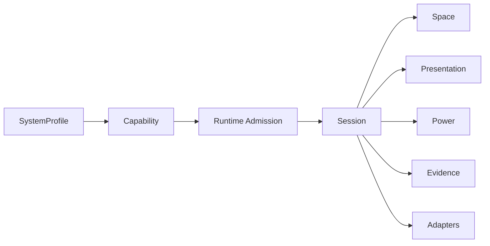

# Architecture Map

Meiso Glass SDK 的当前主线是：先稳定 contract，再逐步把 runtime、adapter、control plane 和 validation 接上。

## 文档到代码的对应关系

| Wiki 页面 | 代码模块 |
|---|---|
| SDK Design Overview | `src/meiso_glass/core` |
| Space / Spatial contract | `src/meiso_glass/space` |
| Presentation contract | `src/meiso_glass/presentation` |
| Power contract | `src/meiso_glass/power` |
| Runtime admission | `src/meiso_glass/runtime/admission.py` |
| Adapter contract | `src/meiso_glass/adapters` |

## 当前要守住的边界

- `DisplayAdapter` 只管 panel、link、brightness、refresh、power。
- `PresentationLayer` 管 layer、view、surface、frame timing。
- `PowerLevel` 是策略等级，不是 mW。
- future depth、stereo、IR、event camera 先进入 `SensorSlot` 和 `SpatialCapability`，不提前写 `DepthCameraAdapter`。
- `UDP` 和 `GStreamer` 是 reference implementation，不是 public SDK contract。
