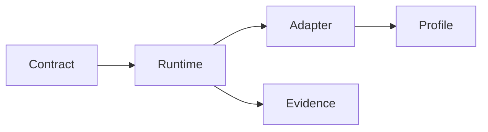

# Diagram Rendering

Wiki 使用 VitePress + Mermaid 渲染架构图。Mermaid 图只承担局部解释，不作为超长总图使用。

## 编写规则

- 每张图只解释一个问题，例如角色关系、运行时路径、测试边界或功耗状态。
- 图节点保持短文本，长解释写在图下方。
- 优先使用多张小图，不使用横向过长的大图。
- Mermaid block 只写英文标识和短英文节点，正文说明继续使用中文。
- 如果图无法清楚表达约束，改用表格或分段文字。

## 维护判断

文档图应该帮助读者判断 SDK contract、runtime、adapter、profile 和 evidence 的边界。如果某张图只是复述标题，或把多个层级混在一起，就应该拆掉重画。
