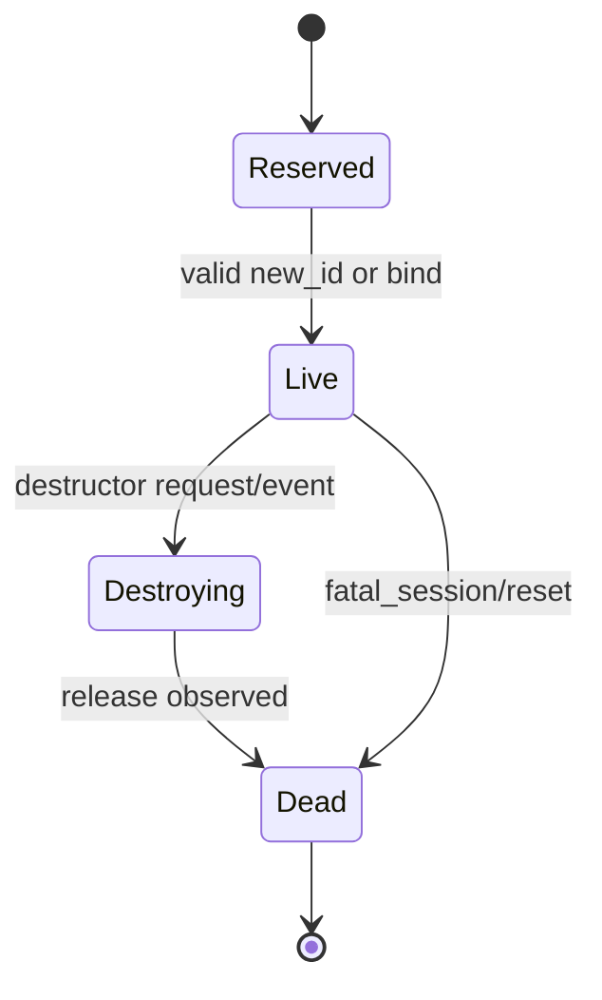

# Object Protocol Spec

本页定义 Meiso Object Protocol V0.1。它位于 Core Wire 之上，负责 Host 和 Edge runtime 的对象、接口、opcode、参数和异步事件。

Core Wire 只看到 `frame_kind=data` 和 payload bytes。Object Protocol 才知道 `feature`、`scene`、`hud`、`sensor`、`asset`、`telemetry`。

## Design Stance

Object Protocol 借鉴 Wayland 的 object/interface/opcode 模型，但不复制 Wayland 的显示语义。

V0.1 的边界：

- Host owns desired state。
- Edge owns runtime state。
- request/event 都是异步消息。
- transport ack 不等于 request accepted。
- object id 是紧凑整数，不是 string。
- interface/opcode 来自 IDL/codegen，不靠每条消息携带可读名称。

## Runtime Payload Shape

Core Wire `data` payload 使用 [Runtime Protocol](./runtime-protocol.md) 的 `meiso_object_binary_v1`。一个 payload 可以包含多个 object message：

```text
object_message[message_len] | object_message[message_len] | ...
```

每个 object message：

```text
object_header[20] | args[args_len]
```

| Offset | Size | Field | Type | Rule |
|---:|---:|---|---|---|
| 0 | 4 | `object_id` | uint32 | dispatch target |
| 4 | 2 | `interface_id` | uint16 | stable numeric interface id |
| 6 | 2 | `interface_version` | uint16 | negotiated version for this object |
| 8 | 2 | `opcode` | uint16 | request/event opcode within interface |
| 10 | 2 | `flags` | uint16 | object message flags |
| 12 | 4 | `serial` | uint32 | sender-local message serial |
| 16 | 2 | `args_len` | uint16 | byte count of args |
| 18 | 2 | `reserved` | uint16 | MUST be 0 in V0.1 |

`message_len = 20 + args_len`。

Object message flags:

| Bit | Name | Rule |
|---:|---|---|
| 0 | `destructor` | message destroys `object_id` after valid dispatch |
| 1 | `has_new_id` | args contain one or more new object ids declared by IDL |
| 2 | `idempotent` | duplicate `serial` may be ignored by receiver |
| 3 | `snapshot` | message carries a complete state snapshot for this object domain |
| 4..15 | reserved | MUST be 0 |

Direction is not a wire field. Receiver derives direction from `sender_role + interface_id + opcode` in generated dispatch tables. Direction mismatch is a protocol error.

## Object ID Allocation

| Range | Owner |
|---:|---|
| `0x00000000` | reserved null |
| `0x00000001` | `meiso_registry` |
| `0x00000002..0x7FFFFFFF` | Host-created objects |
| `0x80000000..0xFFFFFFFE` | Edge-created objects |
| `0xFFFFFFFF` | reserved invalid |

Rules:

- Sender MUST only allocate ids from its owned range.
- `object_id=1` is always live after runtime bootstrap.
- A new object can only be created by an opcode whose IDL declares `new_id`.
- Receiver MUST reject unknown object, wrong interface, unsupported version, wrong direction, duplicate live id or reserved id.
- Session reset destroys transient Host-created object proxies.

## Registry

`object_id=1` is `meiso_registry`。

| Opcode | Direction | Name | Args |
|---:|---|---|---|
| `0` | Edge -> Host | `global` | `name_id`, `interface_id`, `version_min`, `version_max`, `capability_bits` |
| `1` | Edge -> Host | `global_remove` | `name_id` |
| `2` | Host -> Edge | `bind` | `name_id`, `interface_id`, `interface_version`, `new_object_id` |
| `3` | Host -> Edge | `sync` | `sync_id` |
| `4` | Edge -> Host | `done` | `sync_id`, `registry_revision` |

Interface names exist in IDL/docs/debug metadata. They MUST NOT be carried in every runtime message.

## Initial Interfaces

| Interface ID | Interface | Owner Boundary |
|---:|---|---|
| `0x0001` | `meiso_registry` | Edge advertises globals; Host binds objects |
| `0x0002` | `meiso_object` | common object error/lifecycle events |
| `0x0010` | `meiso_session` | runtime session status and close |
| `0x0020` | `meiso_capability` | Edge capability profile snapshots |
| `0x0100` | `meiso_feature_manager` | Host requests feature leases |
| `0x0110` | `meiso_feature_lease` | Edge owns accepted/degraded/revoked lease state |
| `0x0200` | `meiso_scene` | Host owns desired scene state |
| `0x0210` | `meiso_app_hud` | Host owns desired app HUD state |
| `0x0300` | `meiso_sensor_manager` | Host requests sensor subscriptions |
| `0x0310` | `meiso_sensor_stream` | Edge owns sensor sample stream |
| `0x0400` | `meiso_asset_catalog` | Host owns asset catalog/source |
| `0x0410` | `meiso_asset_cache` | Edge owns cache state and misses |
| `0x0500` | `meiso_telemetry` | Edge reports runtime/health/fault state |

This removes runtime message names from Core Wire. `feature_request` becomes `meiso_feature_manager.request_lease`; `scene_snapshot` becomes `meiso_scene.runtime_snapshot`; `hud_update` becomes `meiso_app_hud.set_element` plus `commit`。

## Desired State And Runtime State

Host-owned desired state:

| Area | Host Owns |
|---|---|
| feature | requested feature lease intent and idempotency key |
| scene | desired entity graph, asset refs, display-time intent |
| app HUD | desired app HUD elements only |
| sensor | subscription request |
| asset | source catalog and chunks |

Edge-owned runtime state:

| Area | Edge Owns |
|---|---|
| feature lease | accepted/degraded/rejected/revoked state |
| renderer | renderable scene replica and frame scheduling |
| HUD | final composition, System HUD and safety overlays |
| sensors | hardware adapters, sampling, privacy policy |
| power/thermal | forced downgrade and emergency stop |
| assets | cache state, validation, placeholder behavior |

Host request means desired state was submitted. It does not mean Edge hardware state has changed.

## Commit Semantics

State-changing domains such as `meiso_scene` and `meiso_app_hud` use commit-style messages.

Commit args MUST include:

```text
commit_id              uint64
base_desired_version   uint32
desired_version        uint32
idempotency_key        uint64
display_time_ns        uint64
valid_until_ns         uint64
change_set             binary bytes defined by interface IDL
```

Rules:

- A commit is atomic within one object commit domain.
- Core ack means frame arrived and passed Core Wire validation.
- `commit_result` means Edge validated desired state against capability, policy and resource limits.
- `runtime_snapshot` means Edge observed or applied runtime state.
- Newer desired versions MAY supersede older unapplied desired versions in latest-state domains.
- Stale `base_desired_version` MUST produce `stale_commit` or `conflict` object error.

## Object Error

Object-level errors use `meiso_object.error` event. They are not Core Wire parse errors.

Error fields:

| Field | Meaning |
|---|---|
| `error_code` | stable numeric code |
| `failed_object_id` | target object |
| `failed_interface_id` | interface involved |
| `failed_opcode` | opcode involved |
| `failed_serial` | original sender serial |
| `severity` | `warning`, `recoverable`, `fatal_object`, `fatal_session` |
| `retryable` | bool |
| `details` | typed binary detail from IDL |

Initial error codes:

```text
unknown_object
unknown_interface
unsupported_version
unknown_opcode
invalid_direction
invalid_args
invalid_state
not_owner
permission_denied
policy_rejected
resource_exhausted
stale_commit
conflict
object_gone
timeout
internal_error
```

## Lifecycle



State meaning:

| State | Meaning |
|---|---|
| `Reserved` | id is not live yet |
| `Live` | receiver accepts messages for this object |
| `Destroying` | destructor has been accepted; only lifecycle/error events are valid |
| `Dead` | id is invalid in this session |

## IDL And Codegen

Meiso Object Protocol MUST be generated from an IDL before public implementation locks.

Codegen outputs:

- C headers, encoder, decoder and dispatch tables for Edge.
- Rust typed proxies, event enums and version gates for Host.
- Python bindings for tests, mocks and CLI.
- Markdown tables.
- binary golden vectors.
- schema hash for bootstrap diagnostics.

IDL rules:

- opcodes are append-only within an interface version.
- incompatible args require a new opcode or new interface version.
- generated code MUST validate version, direction, object ownership and args length before handler dispatch.
- string debug names MUST NOT be required for wire compatibility.
