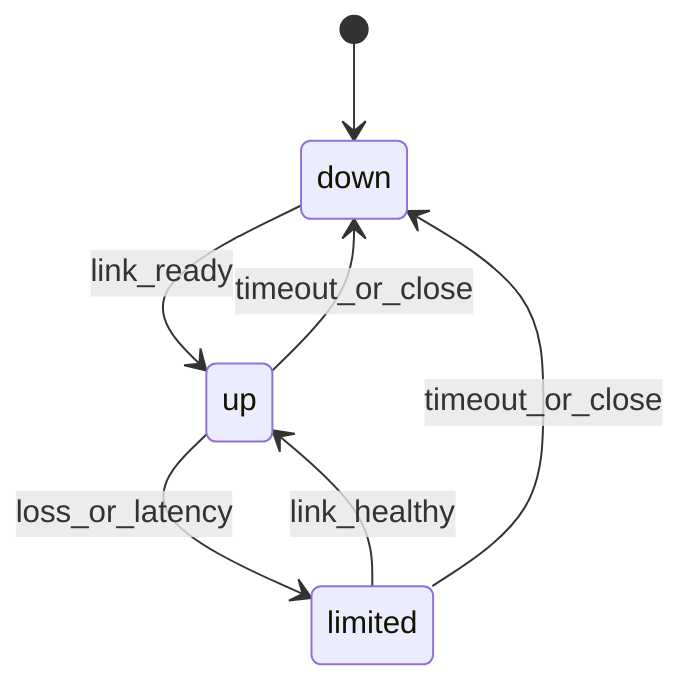
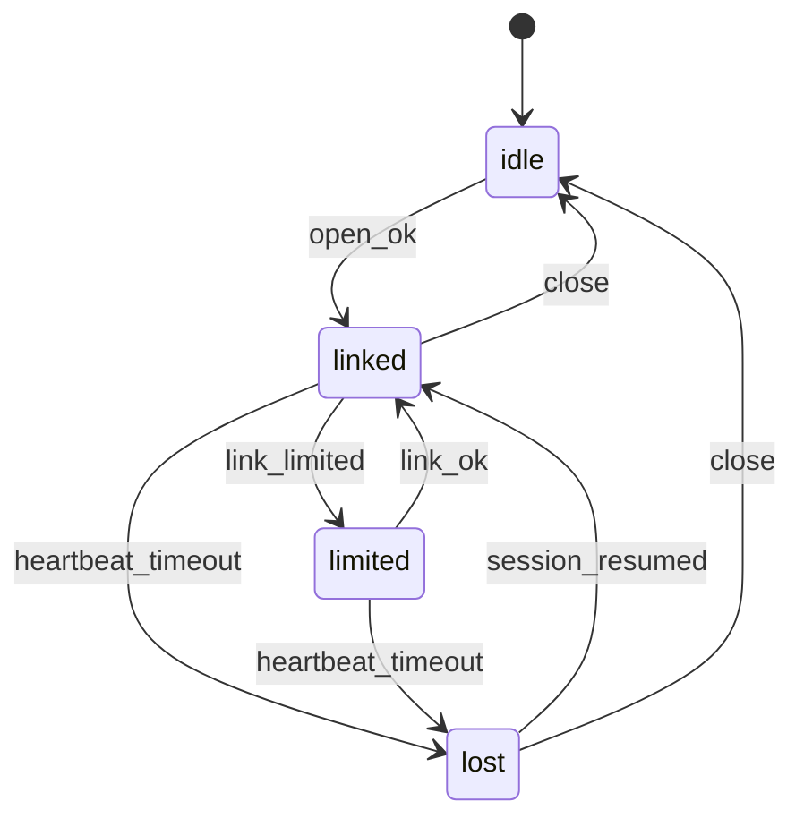
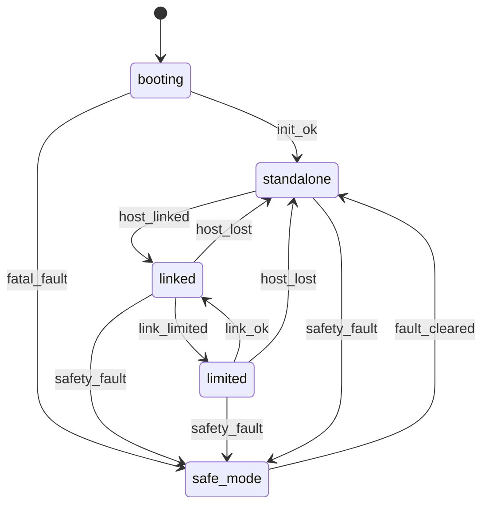
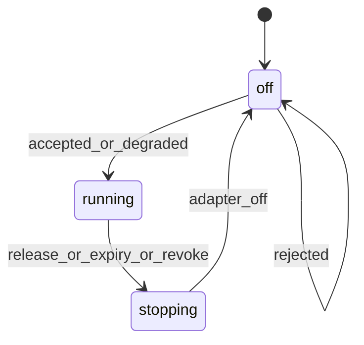
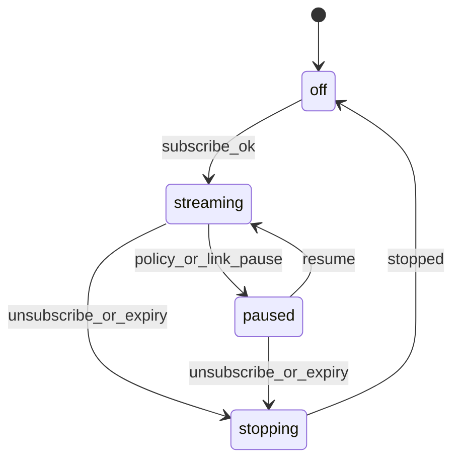
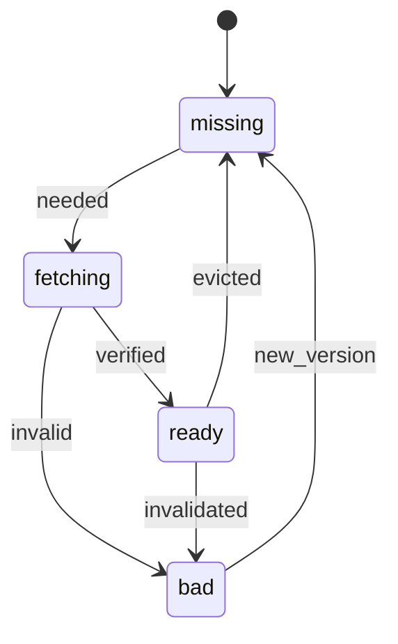

# State Machines Spec

本页定义 V0.1 core 需要的最小状态机。状态不是给用户看的 UI 文案；状态必须承接具体行为。

## State Rule

只有满足至少一条，才允许成为状态：

- 它改变允许发送、接收或执行的操作。
- 它有自发行为，例如 heartbeat、retry、lease expiry、thermal revoke。
- 它保护副作用，例如 stop adapter、dedupe、drop stale frame。
- 它影响恢复路径，例如 resume session、clear lease、use placeholder。

`discovering`、`authenticating`、`syncing`、`requested`、`validating` 这类过程默认是 task / event / transition action，不是 core state。同步可以在 `linked` 状态后台发生，不应该阻塞其它行为。

## Common Rules

- 每个状态必须有 owner。
- Host 和 Edge 的状态分开定义。
- Transport ack 只说明 core frame 到达，不说明业务成功。
- 会产生 side effect 的 runtime message 必须有 idempotency key。
- Unknown 不是安全状态；遇到 unknown 必须 reject、degrade 或进入 safe path。

## Core Link State

Owner：Transport Core，两侧都有。

| State | Allowed Behavior | Self Behavior | Exit |
|---|---|---|---|
| `down` | 不发送 runtime payload；可以发 link probe 或 tiny wake | 清空 non-durable inflight；保留可恢复 session token | link usable -> `up` |
| `up` | 允许所有 delivery class，受 capability / policy 限制 | heartbeat、ack echo、retry reliable frame、统计 RTT/loss | loss/latency high -> `limited`; timeout -> `down` |
| `limited` | 禁止 new bulk；限制 high-bandwidth feature；允许 release/status/tiny control | 提高 ack 频率；降级 bulk；通知 runtime link degraded | link healthy -> `up`; timeout -> `down` |

说明：

- `syncing` 不是状态。Capability exchange、time sync、session resume 都是在 `up` 里的 task。
- `discovering` 不是状态。Discovery 是 link task，成功后产生 `link_ready`。
- `authenticating` 不是状态。Auth 是 transition guard；失败留在 `down`。

## Host Session State

Owner：Host Runtime。

| State | Allowed Behavior | Self Behavior | Exit |
|---|---|---|---|
| `idle` | 创建 session；读取本地 config；不发送 Edge command | 等待 app start 或 operator start | app opens session -> `linked` after link ready |
| `linked` | 发送 feature、scene、HUD、sensor request；接收 telemetry/fault | 发送 heartbeat；重试 unacked reliable frame；后台刷新 capability/time sync | link limited -> `limited`; timeout -> `lost`; close -> `idle` |
| `limited` | 允许 release、status、tiny control；禁止新 high-bandwidth/bulk request | 标记 app-facing degraded；暂停 bulk；尝试恢复 link | link healthy -> `linked`; timeout -> `lost` |
| `lost` | 不发新 feature request；可尝试 session resume | 标记 outstanding request unknown；等待 Edge recovery 或 app close | session resumed -> `linked`; app close -> `idle` |

Host 不拥有 hardware state。Host 的状态只决定它可以请求什么、重试什么、向 app 暴露什么。

## Edge Runtime State

Owner：Edge Runtime。

| State | Allowed Behavior | Self Behavior | Exit |
|---|---|---|---|
| `booting` | 不接受 Host feature request；只允许 safety init | 初始化 HAL、policy、System HUD、power/thermal monitor | init ok -> `standalone`; fatal fault -> `safe_mode` |
| `standalone` | 不接受 Host high-power action；允许 tiny status/wake | 运行 System HUD、thermal/battery policy、low-power sentinel | Host linked -> `linked`; fault -> `safe_mode` |
| `linked` | 接受 Host runtime request，但必须过 policy | 执行 lease expiry、telemetry、frame scheduler、asset request、heartbeat | link limited -> `limited`; Host lost -> `standalone`; fault -> `safe_mode` |
| `limited` | 禁止新 bulk/high-bandwidth；允许 release/status/tiny control | 降级 sensor/render/network；保留 System HUD | link ok -> `linked`; Host lost -> `standalone`; fault -> `safe_mode` |
| `safe_mode` | 拒绝高功耗 feature；只保留 safety/System HUD/thermal path | 撤销 transient lease；关闭或降级 adapter；报告 fault | fault cleared -> `standalone` |

Edge 是最终硬件 owner。Host 消失不等于 Edge 停止；Edge 必须继续 System HUD、thermal、battery 和安全路径。

## Feature Lease State

Owner：Edge Policy Manager。

Feature lease 是 Edge 侧状态。`rejected` 不是状态，只是 request 的结果。`degraded` 也不是单独状态，而是 `running` 的 granted params。

| State | Allowed Behavior | Self Behavior | Exit |
|---|---|---|---|
| `off` | adapter 关闭；可接收 request | 对 request 做 permission/capability/power/policy check | accepted/degraded -> `running` |
| `running` | adapter 按 granted params 工作；发送 telemetry/sample | lease countdown；thermal/battery check；host watchdog | release/expiry/revoke -> `stopping` |
| `stopping` | 不接受同 feature 新 lease；停止 adapter | 关闭硬件；flush final telemetry；emit release/revoke result | adapter off -> `off` |

规则：

- `requestId` 是幂等 key。同一个 `requestId` 重发必须得到同一个 response。
- Camera、microphone、eye 必须有独立 permission state。
- Lease 到期后 Edge 必须关闭高功耗 adapter，不等待 Host。
- Host lost 后 transient lease 必须释放，除非 profile 明确允许 offline continuation。

## Sensor Subscription State

Owner：Edge Sensor Manager。

Sensor subscription 是 Host 请求、Edge 执行。启动 adapter 是 transition action，不需要单独 `starting` 状态。

| State | Allowed Behavior | Self Behavior | Exit |
|---|---|---|---|
| `off` | 无 sample；可接收 subscribe | 无 | subscribe accepted -> `streaming` |
| `streaming` | 发送 sample 或 local result | 按 rate 采样；按 delivery class 丢弃/发送；检查 lease | policy pause/link limited -> `paused`; unsubscribe/expiry -> `stopping` |
| `paused` | 不发新 sample；保留 subscription record | 等 policy/link 恢复；可响应 unsubscribe | resume -> `streaming`; unsubscribe/expiry -> `stopping` |
| `stopping` | 不发新 sample；不接受同 ID 新订阅 | 停止 adapter；flush final status | stopped -> `off` |

规则：

- `subscriptionId` 是订阅主 ID。
- 每个 sample 必须带 `subscriptionId`、`object_seq` 或 runtime sequence、timestamp。
- 高频 sample 使用 `unreliable_latest` 或 media path，不能用 `reliable_ordered` 堵住控制面。
- 订阅必须绑定 feature lease 或明确标记为不需要 lease。

## Asset Cache State

Owner：Edge Asset Cache。Host 拥有 asset source/catalog，Edge 拥有 cache state。

| State | Allowed Behavior | Self Behavior | Exit |
|---|---|---|---|
| `missing` | scene 可引用但显示 placeholder；可请求 asset | 发 `asset_request`；记录 miss telemetry | transfer starts -> `fetching`; object not needed -> `missing` |
| `fetching` | 接收 chunk/range；scene 继续用 placeholder | 请求缺失 chunk；校验 chunk hash；限速 bulk | content hash ok -> `ready`; hash/profile fail -> `bad` |
| `ready` | scene 可使用 asset | 可被 evict policy 选择；校验 version | evicted -> `missing`; validation fail -> `bad` |
| `bad` | 不使用 asset；不重复无限请求 | 报告 error；等待新 version 或 manual clear | new version -> `missing` |

规则：

- Scene message 只引用 `assetId`，不内嵌 asset bytes。
- 缺失 asset 不阻塞整个 scene；Edge 显示 placeholder 并异步请求。
- `assetId` 建议是 content hash，chunk retry 必须可恢复。
- Asset 校验失败必须返回 runtime error 或 telemetry fault。
